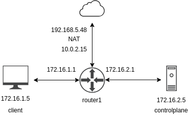
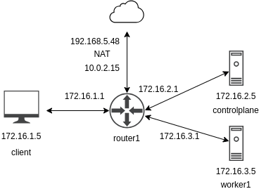

# kvbox: A Local Environment for Testing Lightweight Container Orchestrators

Set up a local working environment with virtual machines created using Vagrant and VirtualBox to test lightweight Kubernetes distributions.

## Software Requirements

- Ubuntu 22.04.3 LTS
- Oracle VirtualBox 6.1.38_Ubuntu_r153438
- Vagrant 2.3.7

## Instructions

Example command lines:
1. `bash kvbox.sh lab1`
2. `./kvbox.sh lab2`
3. `bash kvbox.sh remove`

## Labs

- **Lab 1 (client, controlplane)**

  

- **Lab 2 (client, controlplane, worker1)**

  

# Project File Structure

This repository follows an organized structure for better understanding and efficient code usage. Below is a detailed description of each directory and its contents:

## ansible
Contains playbooks for installing various Kubernetes distributions and related tools.

## img
Stores images used in documentation and other visual resources in the repository.

## kvbox.sh
The main script that initializes the application and serves as the entry point for configuring and deploying both local and remote environments.

## labs
Includes Vagrant files and inventory configurations for virtual machines used in project labs.

## mkdocs
Holds project documentation, viewable by running `python3 -m http.server 3000 --directory mkdocs/site --bind 0.0.0.0`.

### scripts
Houses secondary scripts that streamline the use of various tools. Refer to comments in each script for detailed information on their functions and usage.

## yaml
Contains manifest files used for both local environments with `kvbox.sh` and deployments in a remote Kubernetes cluster.

If you have questions or need more details about a specific part of the project, feel free to refer to the corresponding documentation or send me an email.

Thank you for using this repository! 😊

