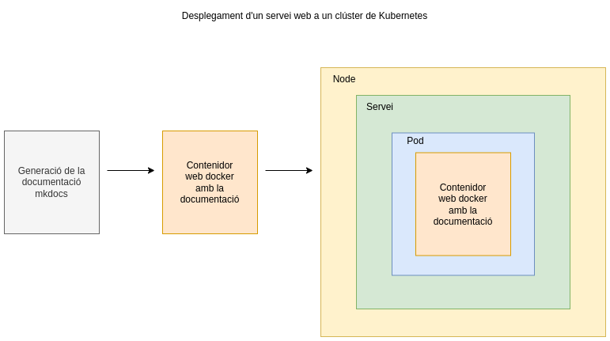

# Desplegament d'un clúster de Kubernetes amb K3s

Video a la prova realitzada: <a href="https://youtu.be/l4vhvikY33o" target="_blank">Desplegament d'un servei web en un entorn local amb K3s</a>

## Objectiu



L'objectiu és crear una pàgina de documentació de prova generada amb MKDocs, afegir-la a un contenidor, i configurar un fitxer manifest de kubernetes per
desplegar un pod i un servei de tipos NodePort dins d'un cúster de K3s.

## Requisits

- Docker
- Cluster de Kubernetes

## Creació de l'estructura de fitxers amb el contenidor squidfunk/mkdocs-material

```
docker run --rm -it -p 8000:8000 -v "$PWD":/docs squidfunk/mkdocs-material new .

```

## Modificació del contingut en format markdown 

Creació del contingut en els fitxers md i el fitxer de configuració mkdocs.yml.

## Generació de la documentació

```
docker run --rm -it -v "$PWD":/docs squidfunk/mkdocs-material build
```

## Creació d'un fitxer manifest per a kubernetes amb un Servei per exposar l'aplicació dins d'un cluster de k3s

```
apiVersion: v1
kind: Pod
metadata:
  name: web1
  labels:
    app: web
spec:
  containers:
    - name: webtest
      image: https:alpine
      ports:
        - containerPort: 80
      volumeMounts:
        - name: html-volume
          mountPath: /usr/local/apache2/htdocs
  volumes:
    - name: html-volume
      hostPath:
        path: /home/vagrant/mkdocs/site

---
apiVersion: v1
kind: Service
metadata:
  name: service1
spec:
  type: NodePort
  selector:
    app: web
  ports:
    - protocol: TCP
      port: 80
      targetPort: 80
      nodePort: 30000

```

## Comanda per desplegar el servei

```
kubectl apply -f docu_service.yaml 
    
```