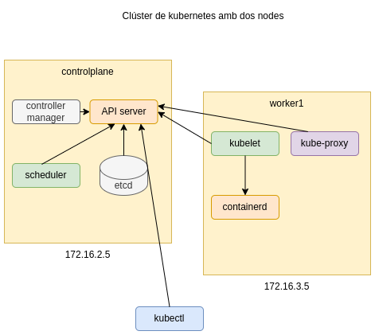

# Desplegament d'un clúster de Kubernetes amb kubeadm

Vídeo a la prova realitzada: <a href="https://youtu.be/wE5VCjDbP34" target="_blank">Desplegament d'un clúster de Kubernetes amb kubeadm</a>

## Objectiu



Desplegar un clúster de Kubernetes amb kubeadm.

## Instal·lació pas a pas de kubernetes amb kubeadm

### Controlplane

Mode root

```
sudo -i
```

Actualitzar el sistema

```
apt update && apt upgrade -y
```

Instal·lar paquets necessaris

```
apt install curl apt-transport-https vim git wget \
software-properties-common lsb-release ca-certificates -y
```

Desactivar swap

```
swapoff -a
```

Carregar els següents mòduls:

```
modprobe overlay
modprobe br_netfilter
```

Actualitzar el kernel per permetre el tràfic

```
cat << EOF | tee /etc/sysctl.d/kubernetes.conf
net.bridge.bridge-nf-call-ip6tables = 1
net.bridge.bridge-nf-call-iptables = 1
net.ipv4.ip_forward = 1
EOF
```

Verificar que els canvis s'han realitzat

```
sysctl --system
```

Instal·lar la clau necessària per a la instal·lació

```
sudo mkdir -p /etc/apt/keyrings
curl -fsSL https://download.docker.com/linux/ubuntu/gpg \
| sudo gpg --dearmor -o /etc/apt/keyrings/docker.gpg

echo \ "deb [arch=$(dpkg --print-architecture) signed-by=/etc/apt/keyrings/docker.gpg] \
https://download.docker.com/linux/ubuntu \
$(lsb_release -cs) stable" | sudo tee /etc/apt/sources.list.d/docker.list > /dev/null
```

Instal·lar containerd

```
apt-get update && apt-get install containerd.io -y
containerd config default | tee /etc/containerd/config.toml
sed -e 's/SystemdCgroup = false/SystemdCgroup = true/g' -i /etc/containerd/config.toml
systemctl restart containerd
```

Crear un nou repositori per a Kubernetes

```
echo 'deb https://packages.cloud.google.com/apt kubernetes-xenial main' > /etc/apt/sources.list.d/kubernetes.list

```

Afegir la clau GPG per als paquets:

```
curl -fsSL "https://packages.cloud.google.com/apt/doc/apt-key.gpg" | sudo gpg --dearmor -o /etc/apt/trusted.gpg.d/kubernetes-archive-keyring.gpg
```

Actualitzar i instal·lar kubeadm, kubectl i kubelet

```
apt update -y
apt install kubeadm kubectl kubelet
```

Configurar els paquets perquè no s'actualitzin

```
apt-mark hold kubelet kubeadm kubectl
```

Afegir un DNS local al servidor controlplane

```
# editar /etc/hosts

172.16.2.5  controlplane
```

Crear un fitxer de configuració pel clúster

```
# vim kubeadm-config.yaml

apiVersion: kubeadm.k8s.io/v1beta3
kind: ClusterConfiguration
kubernetesVersion: 1.28.2
controlPlaneEndpoint: "controlplane:6443"
networking:
  podSubnet: 172.16.2.0/24 
```

Inicialitzar el node controlplane

```
kubeadm init --config=kubeadm-config.yaml --upload-certs | tee kubeadm-init.out
```

Logout root i configurar l'usuari com administrado del clúster

```
exit
mkdir -p $HOME/.kube
sudo cp -i /etc/kubernetes/admin.conf $HOME/.kube/config
sudo chown $(id -u):$(id -g) $HOME/.kube/config
less $HOME/.kube/config
```

Instal·lar el gestor de paquets Helm

```
wget https://get.helm.sh/helm-v3.13.2-linux-amd64.tar.gz
tar -zxvf helm-v3.13.2-linux-amd64.tar.gz
mv linux-amd64/helm /usr/local/bin/helm
```

Seleccionar un pod de xarxa per al CNI (Container Networking Interface) hi ha diversos, Cilium o Calico són bastant populars.

```
helm repo add cilium https://helm.cilium.io/
helm repo update
helm template cilium cilium/cilium --namespace kube-system > cilium.yaml
kubectl apply -f cilium.yaml
```

Instal·lar autocompletat

```
sudo apt-get install bash-completion -y
source <(kubectl completion bash)
echo "source <(kubectl completion bash)" >> $HOME/.bashrc
```

### Worker1

Repetir els mateixos passos que al node anterior des de l'inici fins a afegir un DNS local al node worker

Mode root

```
sudo -i
```

Actualitzar el sistema

```
apt update && apt upgrade -y
```

Instal·lar paquets necessaris

```
apt install curl apt-transport-https vim git wget \
software-properties-common lsb-release ca-certificates -y
```

Desactivar swap

```
swapoff -a
```

Carregar els següents mòduls

```
modprobe overlay
modprobe br_netfilter
```

Actualitzar el kernel per permetre el tràfic

```
cat << EOF | tee /etc/sysctl.d/kubernetes.conf
net.bridge.bridge-nf-call-ip6tables = 1
net.bridge.bridge-nf-call-iptables = 1
net.ipv4.ip_forward = 1
EOF
```

Verificar que els canvis s'han realitzat

```
sysctl --system
```

Instal·lar la clau necessària per a la instal·lació

```
sudo mkdir -p /etc/apt/keyrings
curl -fsSL https://download.docker.com/linux/ubuntu/gpg \
| sudo gpg --dearmor -o /etc/apt/keyrings/docker.gpg

echo \ "deb [arch=$(dpkg --print-architecture) signed-by=/etc/apt/keyrings/docker.gpg] \
https://download.docker.com/linux/ubuntu \
$(lsb_release -cs) stable" | sudo tee /etc/apt/sources.list.d/docker.list > /dev/null
```

Install containerd

```
apt-get update && apt-get install containerd.io -y
containerd config default | tee /etc/containerd/config.toml
sed -e 's/SystemdCgroup = false/SystemdCgroup = true/g' -i /etc/containerd/config.toml
systemctl restart containerd
```

Crear un nou repositori per a Kubernetes

```
echo 'deb https://packages.cloud.google.com/apt kubernetes-xenial main' > /etc/apt/sources.list.d/kubernetes.list

```

Afegir la clau GPG per als paquets:

```
curl -fsSL "https://packages.cloud.google.com/apt/doc/apt-key.gpg" | sudo gpg --dearmor -o /etc/apt/trusted.gpg.d/kubernetes-archive-keyring.gpg
```

Actualitzar i instal·lar kubeadm, kubectl i kubelet

```
apt update -y
apt install kubeadm kubectl kubelet
```

Configurar els paquets perquè no s'actualitzin

```
apt-mark hold kubelet kubeadm kubectl
```

Afegir un DNS local al servidor worker1

```
# editar /etc/hosts
172.16.3.5  worker1
172.16.2.5  controlplane
```

Per unir el worker al clúster del controlplane es pot utilitzar la instrucció join amb el token inicial que mostra la primera vegada el controlplane o bé generar un nou token
```
sudo kubeadm token list
```

Creació d'un nou token (al controlplane)

```
sudo kubeadm token create
```

Generació del discovery token CA cert hash per permetre la unió del node worker

```
openssl x509 -pubkey \
-in /etc/kubernetes/pki/ca.crt | openssl rsa \
-pubin -outform der 2>/dev/null | openssl dgst \
-sha256 -hex | sed 's/^.* //'
```

Utilitzar el token i el discovery token al worker node

```
sudo -i
kubeadm join --token token_exemple controlplane:6443 \
--discovery-token-ca-cert-hash sha256:hash_exemple
```

Anar al controlplane i verificar que tot funciona correctament

```
kubectl get node
kubectl describe node controlplane
```

Permetre que controlplane pugui contenir pods que no siguin del sistema

```
kubectl taint nodes --all node-role.kubernetes.io/control-plane-
```

Verificar que cilium i coredns funcionen correctament

```
kubectl get pods --all-namespaces
```

Actualització de crictl

```
sudo crictl config --set \
runtime-endpoint=unix:///run/containerd/containerd.sock \
--set image-endpoint=unix:///run/containerd/containerd.sock

sudo cat /etc/crictl.yaml
```