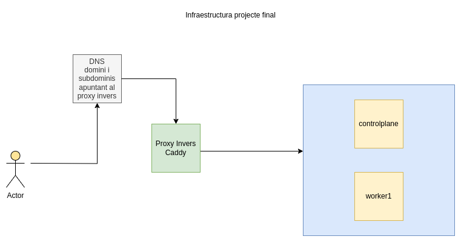

# Proves en servidors remots I 

Vídeo a la prova realitzada: <a href="" target="_blank">Desplegament d'un clúster de Kubernetes en un entorn remot amb kubeadm</a>

## Objectiu



Desplegar un clúster de Kubernetes amb kubeadm.

## Configuració dels servidors

Canvi de nom del host

```
Modificar els fitxers /etc/hostname i /etc/hosts
sudo hostnamectl set-hostname controlplane
sudo systemctl restart systemd-hostnamed
```

Inici de sessió via ssh amb la ip pública i la contrasenya inicial

```
ssh root@your_server_ip
```

Creació d'un nou usuari 

```
adduser josan
```

Afegir al nou usuari al grup sudo per ser administrador

```
usermod -aG sudo josan
```

Configurar el firewall ufw

```
sudo ufw allow from ip
ufw allow 22/tcp
sudo ufw default deny incoming
sudo ufw default deny outgoing
ufw enable
ufw status numbered
```

Accedir amb el nou usuari i contrasenya

```
ssh josan@your_server_ip
```

Passos opcionals, per millorar la seguretat del servidor:

Modificar el port ssh

```
# vim nano /etc/ssh/sshd_config
Port 2222
sudo service sshd restart
sudo ufw allow 2222/tcp
sudo ufw deny 22/tcp
sudo ufw reload
```

En el client, generar parell de claus RSA

```
ssh-keygen -t rsa -b 2048
```

Copiar la clau pública al servidor públic

```
ssh-copy-id usuario@direccion_ip -p port
ssh -p '2222' 'josan@direccio_ip' 
```

Configurar el servidor perquè només es pugui entrar amb clau RSA

```
# vim nano /etc/ssh/sshd_config
PermitRootLogin no
PasswordAuthentication no
```

Altres mesures de seguretat que es poden configurar:

```
# vim nano /etc/ssh/sshd_config
LoginGraceTime 10m
MaxAuthTries 1
```

Es podria considerar instal.lar Fail2Ban i altres capes de seguretat.

## Instal·lació pas a pas de kubernetes amb kubeadm

Modificar els ports dels firewalls dels dos nodes:

Al controlplane:

```
sudo ufw allow 80/tcp
sudo ufw allow out 80 o sudo ufw default allow outgoing
sudo ufw allow 6443/tcp
sudo ufw allow 2379:2380/tcp
sudo ufw allow 10250/tcp
sudo ufw allow 10259/tcp
sudo ufw allow 10257/tcp
```

Al worker1:

```
sudo ufw allow 10250/tcp
sudo ufw allow 30000:32767/tcp
```

Instal.lació de k8s al controlplane:

### Controlplane

Mode root

```
sudo -i
```

Actualitzar el sistema

```
apt update && apt upgrade -y
```

Instal·lar paquets necessaris

```
apt install curl apt-transport-https vim git wget \
software-properties-common lsb-release ca-certificates -y
```

Desactivar swap

```
swapoff -a
```

Carregar els següents mòduls:

```
modprobe overlay
modprobe br_netfilter
```

Actualitzar el kernel per permetre el tràfic

```
cat << EOF | tee /etc/sysctl.d/kubernetes.conf
net.bridge.bridge-nf-call-ip6tables = 1
net.bridge.bridge-nf-call-iptables = 1
net.ipv4.ip_forward = 1
EOF
```

Verificar que els canvis s'han realitzat

```
sysctl --system
```

Instal·lar la clau necessària per a la instal·lació

```
sudo mkdir -p /etc/apt/keyrings
curl -fsSL https://download.docker.com/linux/ubuntu/gpg \
| sudo gpg --dearmor -o /etc/apt/keyrings/docker.gpg

echo \ "deb [arch=$(dpkg --print-architecture) signed-by=/etc/apt/keyrings/docker.gpg] \
https://download.docker.com/linux/ubuntu \
$(lsb_release -cs) stable" | sudo tee /etc/apt/sources.list.d/docker.list > /dev/null
```

Instal·lar containerd

```
apt-get update && apt-get install containerd.io -y
containerd config default | tee /etc/containerd/config.toml
sed -e 's/SystemdCgroup = false/SystemdCgroup = true/g' -i /etc/containerd/config.toml
systemctl restart containerd
```

Crear un nou repositori per a Kubernetes

```
echo 'deb https://packages.cloud.google.com/apt kubernetes-xenial main' > /etc/apt/sources.list.d/kubernetes.list

```

Afegir la clau GPG per als paquets:

```
curl -fsSL "https://packages.cloud.google.com/apt/doc/apt-key.gpg" | sudo gpg --dearmor -o /etc/apt/trusted.gpg.d/kubernetes-archive-keyring.gpg
```

Actualitzar i instal·lar kubeadm, kubectl i kubelet

```
apt update -y
apt install kubeadm kubectl kubelet
```

Configurar els paquets perquè no s'actualitzin

```
apt-mark hold kubelet kubeadm kubectl
```

Afegir un DNS local al servidor controlplane

```
# editar /etc/hosts

172.16.2.5  controlplane
```

Crear un fitxer de configuració pel clúster

```
# vim kubeadm-config.yaml

apiVersion: kubeadm.k8s.io/v1beta3
kind: ClusterConfiguration
kubernetesVersion: 1.28.2
controlPlaneEndpoint: "controlplane:6443"
networking:
  podSubnet: 172.16.2.0/24 
```

Inicialitzar el node controlplane

```
kubeadm init --config=kubeadm-config.yaml --upload-certs | tee kubeadm-init.out
```

Logout root i configurar l'usuari com administrado del clúster

```
exit
mkdir -p $HOME/.kube
sudo cp -i /etc/kubernetes/admin.conf $HOME/.kube/config
sudo chown $(id -u):$(id -g) $HOME/.kube/config
less $HOME/.kube/config
```

Instal·lar el gestor de paquets Helm

```
wget https://get.helm.sh/helm-v3.13.2-linux-amd64.tar.gz
tar -zxvf helm-v3.13.2-linux-amd64.tar.gz
mv linux-amd64/helm /usr/local/bin/helm
```

Seleccionar un pod de xarxa per al CNI (Container Networking Interface) hi ha diversos, Cilium o Calico són bastant populars.

```
helm repo add cilium https://helm.cilium.io/
helm repo update
helm template cilium cilium/cilium --namespace kube-system > cilium.yaml
kubectl apply -f cilium.yaml
```

Instal·lar autocompletat

```
sudo apt-get install bash-completion -y
source <(kubectl completion bash)
echo "source <(kubectl completion bash)" >> $HOME/.bashrc
```

### Worker1

Repetir els mateixos passos que al node anterior des de l'inici fins a afegir un DNS local al node worker

Mode root

```
sudo -i
```

Actualitzar el sistema

```
apt update && apt upgrade -y
```

Instal·lar paquets necessaris

```
apt install curl apt-transport-https vim git wget \
software-properties-common lsb-release ca-certificates -y
```

Desactivar swap

```
swapoff -a
```

Carregar els següents mòduls

```
modprobe overlay
modprobe br_netfilter
```

Actualitzar el kernel per permetre el tràfic

```
cat << EOF | tee /etc/sysctl.d/kubernetes.conf
net.bridge.bridge-nf-call-ip6tables = 1
net.bridge.bridge-nf-call-iptables = 1
net.ipv4.ip_forward = 1
EOF
```

Verificar que els canvis s'han realitzat

```
sysctl --system
```

Instal·lar la clau necessària per a la instal·lació

```
sudo mkdir -p /etc/apt/keyrings
curl -fsSL https://download.docker.com/linux/ubuntu/gpg \
| sudo gpg --dearmor -o /etc/apt/keyrings/docker.gpg

echo \ "deb [arch=$(dpkg --print-architecture) signed-by=/etc/apt/keyrings/docker.gpg] \
https://download.docker.com/linux/ubuntu \
$(lsb_release -cs) stable" | sudo tee /etc/apt/sources.list.d/docker.list > /dev/null
```

Install containerd

```
apt-get update && apt-get install containerd.io -y
containerd config default | tee /etc/containerd/config.toml
sed -e 's/SystemdCgroup = false/SystemdCgroup = true/g' -i /etc/containerd/config.toml
systemctl restart containerd
```

Crear un nou repositori per a Kubernetes

```
echo 'deb https://packages.cloud.google.com/apt kubernetes-xenial main' > /etc/apt/sources.list.d/kubernetes.list

```

Afegir la clau GPG per als paquets:

```
curl -fsSL "https://packages.cloud.google.com/apt/doc/apt-key.gpg" | sudo gpg --dearmor -o /etc/apt/trusted.gpg.d/kubernetes-archive-keyring.gpg
```

Actualitzar i instal·lar kubeadm, kubectl i kubelet

```
apt update -y
apt install kubeadm kubectl kubelet
```

Configurar els paquets perquè no s'actualitzin

```
apt-mark hold kubelet kubeadm kubectl
```

Afegir un DNS local al servidor worker1

```
# editar /etc/hosts
172.16.3.5  worker1
172.16.2.5  controlplane
```

Per unir el worker al clúster del controlplane es pot utilitzar la instrucció join amb el token inicial que mostra la primera vegada el controlplane o bé generar un nou token
```
sudo kubeadm token list
```

Creació d'un nou token (al controlplane)

```
sudo kubeadm token create
```

Generació del discovery token CA cert hash per permetre la unió del node worker

```
openssl x509 -pubkey \
-in /etc/kubernetes/pki/ca.crt | openssl rsa \
-pubin -outform der 2>/dev/null | openssl dgst \
-sha256 -hex | sed 's/^.* //'
```

Utilitzar el token i el discovery token al worker node

```
sudo -i
kubeadm join --token 27eee4.6e66ff60318da929 controlplane:6443 \
--discovery-token-ca-cert-hash sha256:6d541678b05652e1fa5d43908e75e67376e994c3483d6683f2a18673e5d2a1b0
```

Anar al controlplane i verificar que tot funciona correctament

```
kubectl get node
kubectl describe node controlplane
```

Permetre que controlplane pugui contenir pods que no siguin del sistema

```
kubectl taint nodes --all node-role.kubernetes.io/control-plane-
```

Verificar que cilium i coredns funcionen correctament

```
kubectl get pods --all-namespaces
```

Actualització de crictl

```
sudo crictl config --set \
runtime-endpoint=unix:///run/containerd/containerd.sock \
--set image-endpoint=unix:///run/containerd/containerd.sock

sudo cat /etc/crictl.yaml
```
### Nginx Ingress Controller 

```
# Instal·lació per entorns baremetal
kubectl apply -f https://raw.githubusercontent.com/kubernetes/ingress-nginx/controller-v1.1.3/deploy/static/provider/baremetal/deploy.yaml
kubectl get pods -n ingress-nginx
kubectl get services -n ingress-nginx
kubectl -n ingress-nginx get ingressclasses

# Anotació per entorns on s'executa un únic controlador
kubectl -n ingress-nginx annotate ingressclasses nginx ingressclass.kubernetes.io/is-default-class="true"

# Verificar el funcionament
curl <worker-external-ip>:<node-port>
```

### Kubernetes Ingress

```
apiVersion: networking.k8s.io/v1
kind: Ingress
metadata:
  name: demo-ingress
  annotations:
    kubernetes.io/ingress.class: nginx
    #nginx.ingress.kubernetes.io/rewrite-target: /
spec:
  ingressClassName: nginx
  rules:
  - host: docs.cluster.test
    http:
      paths:
      - path: /
        pathType: Prefix 
        backend:
          service:
            name: docs-service 
            port:
              number: 80
  - host: chat-ai.cluster.test
    http:
      paths:
      - path: /
        pathType: Prefix 
        backend:
          service:
            name: ollama-frontend-service 
            port:
              number: 80
```

### Desplegament de serveis

Exemple: docs-deployment.yaml

```
apiVersion: apps/v1
kind: Deployment
metadata:
  name: docs 
spec:
  replicas: 1
  selector:
    matchLabels:
      app: docs-app 
  template:
    metadata:
      labels:
        app: docs-app 
    spec:
      containers:
        - name: docuweb 
          image: josanescod/docs:1.0 
          ports:
            - containerPort: 80            
---
apiVersion: v1
kind: Service
metadata:
  name: docs-service
spec:
  selector:
    app: docs-app
  ports:
    - protocol: TCP
      port: 80
      targetPort: 80 
```

### Configuració DNS

Opcionalment es pot configurar i apuntar subdominis a la ip de worker1

Exemple:

```
A     cluster.test              ip-del-servidor
A     docs.cluster.test         ip-del-servidor
A     chat-ai.cluster.test      ip-del-servidor
A     repository.cluster.test   ip-del-servidor
A     dashboard.cluster.test    ip-del-servidor

```

A partir d'aquí es podria anar al navegador i posar http://docs.cluster.test:nodeport i el cluster
respondria a la petició.

### Configuració d'un servidor reverse proxy

També es pot configurar un servidor proxy invers per actuar d'intermediari entre les peticions

del client i el cluster i no tenir que posar el port al navegador. En aquest cas s'ha utilitzat [Caddy Server](https://caddyserver.com/){:target="_blank"} 

per la simplicitat per realitzar la configuració. 

Instal·lació de Caddy

```
wget -P /tmp https://github.com/caddyserver/caddy/releases/download/v2.7.6/caddy_2.7.6_linux_amd64.tar.gz \
&& sudo chmod +x /tmp/caddy_2.7.6_linux_amd64.tar.gz && sudo tar -xzvf /tmp/caddy_2.7.6_linux_amd64.tar.gz \
&& sudo mv caddy /usr/local/bin/

```


Cofiguració de Caddyfile

```
#/etc/caddy/Caddyfile
docs.josanesc.com {
    reverse_proxy ip_node:NodePort
}

repository.josanesc.com {
    reverse_proxy ip_node:NodePort
}

chat-ai.josanesc.com {
    reverse_proxy ip_node:NodePort
}

dashboard.josanesc.com {
    reverse_proxy ip_node:NodePort
}

k8s-tfg.josanesc.com {
    reverse_proxy ip_node:NodePort
}
```

Crear un servei systemd per a caddy

```
sudo nano /lib/systemd/system/caddy.service

[Unit]
Description=Caddy
Documentation=https://caddyserver.com/docs/
After=network.target network-online.target
Requires=network-online.target

[Service]
Type=notify
User=caddy
Group=caddy
ExecStart=/usr/bin/caddy run --environ --config /etc/caddy/Caddyfile
ExecReload=/usr/bin/caddy reload --config /etc/caddy/Caddyfile --force
TimeoutStopSec=5s
LimitNOFILE=1048576
LimitNPROC=512
PrivateTmp=true
ProtectSystem=full
AmbientCapabilities=CAP_NET_ADMIN CAP_NET_BIND_SERVICE

[Install]
WantedBy=multi-user.target
```

```
sudo systemctl daemon-reload
sudo systemctl enable caddy
sudo systemctl start caddy
sudo systemctl status caddy
```


### Basic Auth

``` 

```

### Resultat final


### Desplegament amb Terraform


### Coses pendents

1. Dashboard amb autenticació

2. TIG (Telegraf, InfluxDB, Grafana) , Custom Self-Hosted Container Registry tipo Harbor

3. Terraform per desplegar tot el cluster

4. Desplegar un tercer node multiproveidor? 

5. Automatitzar totes les tasques possibles amb Ansible (Instal.lació de kubeadm als 2/3 nodes, aplicació dels manifests)

6. Pasar-ho tot al repo i documentar.

7. Memòria.