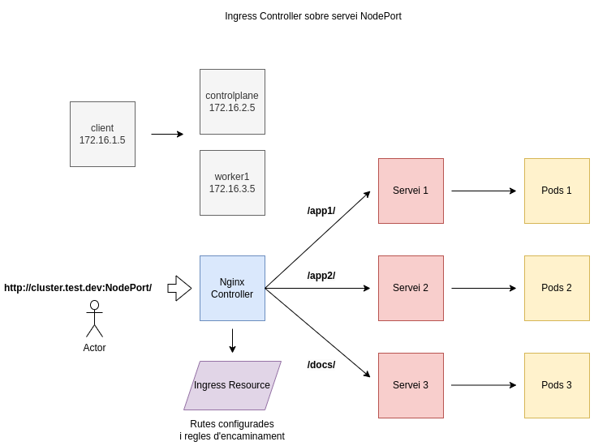

# Desplegament d'un clúster de Kubernetes amb k0s

Vídeo a la prova realitzada: <a href="" target="_blank">Desplegament d'un clúster de Kubernetes amb k0s en un entorn local</a>

## Objectiu



Desplegar un clúster de Kubernetes amb la distribució k0s i practicar els conceptes de Ingress Controller, Ingress, Persistent Volume,
Persistent Volume Claim. 

## Creació del clúster

```
# control plane
mkdir -p /etc/k0s
k0s config create > /etc/k0s/k0s.yaml
sudo k0s install controller --enable-worker -c /etc/k0s/k0s.yaml
sudo k0s start
sudo k0s token create --role=worker

# worker
copiar el token a un fitxer token.txt
sudo k0s install worker --token-file token.txt
sudo k0s start

# control plane
sudo k0s run worker
kubectl label node worker1 node-role.kubernetes.io/worker=worker
```

## Ingress Controller

Un Ingress Controller és una aplicació que s'executa en un clúster i configura el balanceig de càrrega http segons els recursos Ingress.
Es pot configurar de diverses maneres, en un entorn baremetal sense loadBalancers de proveidors hi ha diverses solucions amb els seus pros i contres,
explicats a la documentació oficial, per al vídeo de proves s'utilitza la guia de k0s on s'instal·la un NGINX Ingress Controller utilitzant NodePort.

Per la instal·lació m'he basat en dues fonts:

* la documentació oficial de k0s: [Installing NGINX Ingress Controller](https://docs.k0sproject.io/v1.28.4+k0s.0/examples/nginx-ingress/){:target="_blank"} 
* la guia d'instal·lació del repositori de ingress-nginx: [Installation Guide](https://kubernetes.github.io/ingress-nginx/deploy/){:target="_blank"}.

```
# Instal·lació per entorns baremetal
kubectl apply -f https://raw.githubusercontent.com/kubernetes/ingress-nginx/controller-v1.1.3/deploy/static/provider/baremetal/deploy.yaml
kubectl get pods -n ingress-nginx
kubectl get services -n ingress-nginx
kubectl -n ingress-nginx get ingressclasses

# Anotació per entorns on s'executa un únic controlador
kubectl -n ingress-nginx annotate ingressclasses nginx ingressclass.kubernetes.io/is-default-class="true"

# Verificar el funcionament
curl <worker-external-ip>:<node-port>
```

## Ingress (recurs de Kubernetes)

Ingress és un recurs de Kubernetes que permet exposar i gestionar sol·licituds a diferents serveis segons el seu URL. 

```
apiVersion: networking.k8s.io/v1
kind: Ingress
metadata:
  annotations:
    nginx.ingress.kubernetes.io/rewrite-target: /$1
    nginx.ingress.kubernetes.io/enable-cors: "false"
    nginx.ingress.kubernetes.io/backend-protocol: HTTP
  name: web-server-ingress

spec:
  ingressClassName: nginx
  rules:
  - host: cluster.test.dev
    http:
      paths:
      - path: /app1/(.*)
        pathType: Prefix
        backend:
          service:
            name: nodeapp-service
            port:
              number: 3000
      - path: /app2/(.*)
        pathType: Prefix
        backend:
          service:
            name: nodeapp2-service
            port:
              number: 4000
      - path: /docs/(.*)
        pathType: Prefix
        backend:
          service:
            name: docs-service
            port:
              number: 5000

```

## Persistence Volume

Un Persistence Volume és un recurs de Kubernetes que representa un volum d'emmagatzematge persistent, com un disc o espai d'emmagatzematge al núvol.
És una abstracció que permet a les aplicacions sol·licitar espai d'emmagatzematge.

```
apiVersion: v1
kind: PersistentVolume
metadata:
  name: my-pv
spec:
  capacity:
    storage: 2Gi
  volumeMode: Filesystem
  accessModes:
    - ReadWriteOnce
  hostPath:
    path: /path/to/host/folder
```

## Persistence Volume Claim

Un Persistence Volume Claim és un objecte de Kubernetes que representa una sol·licitud de recursos d'emmagatzematge. Ha d'haver-hi un PV per poder vincular un PVC.

```
apiVersion: v1
kind: PersistentVolumeClaim
metadata:
  name: my-pvc
spec:
  accessModes:
    - ReadWriteOnce
  resources:
    requests:
      storage: 1Gi
```

## Exemple PV i PVC

1. Es defineix un Persistent Volume 'my-pv'
2. Es defineix un Persistent Volume Claim 'my-pvc'
3. Un deployment pot utilitzar un pvc a través d'un volum 'my-storage'

```
apiVersion: v1
kind: PersistentVolume
metadata:
  name: my-pv
spec:
  capacity:
    storage: 5Gi
  volumeMode: Filesystem
  accessModes:
    - ReadWriteOnce
  hostPath:
    path: /path/to/host/folder

---
apiVersion: v1
kind: PersistentVolumeClaim
metadata:
  name: my-pvc
spec:
  accessModes:
    - ReadWriteOnce
  resources:
    requests:
      storage: 3Gi

---
apiVersion: apps/v1
kind: Deployment
metadata:
  name: my-deployment
spec:
  replicas: 3
  selector:
    matchLabels:
      app: my-app
  template:
    metadata:
      labels:
        app: my-app
    spec:
      containers:
      - name: my-container
        image: nginx
        volumeMounts:
        - name: my-storage
          mountPath: /usr/share/nginx/html
  volumes:
  - name: my-storage
    persistentVolumeClaim:
      claimName: my-pvc

```