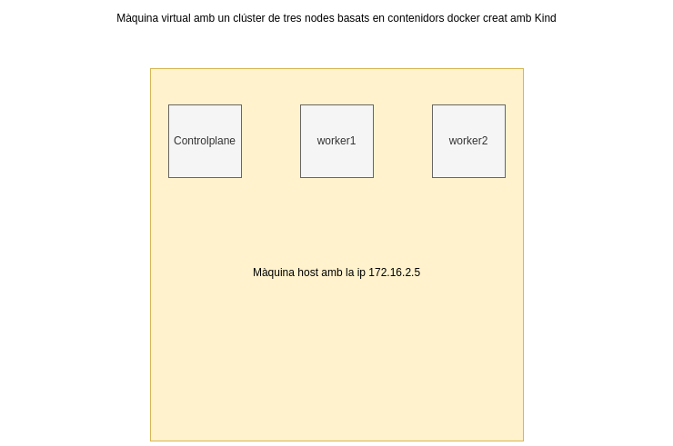

# Desplegament d'un clúster de Kubernetes amb Kind

Vídeo a la prova realitzada: <a href="" target="_blank">Desplegament d'un servei web en un entorn local amb Kind</a>

## Objectiu



Crear un clúster amb Kind i provar alguns dels recursos de la seva API: daemonSet, job, cronjob, configmap i secret.

Com que Kind és una distribució de Kubernetes basada en contenidors docker, en aquesta ocasió només s'utilitzarà una màquina
virtual de l'entorn de proves.


## Creació del clúster

Creem un fitxer kind-example-config.yaml amb el següent contingut:

``` 
apiVersion: kind.x-k8s.io/v1alpha4
kind: Cluster
nodes:
- role: control-plane
- role: worker
- role: worker
```

kind create cluster --config kind-example-config.yaml

export KUBECONFIG per poder utilizar kubectl

## Etiquetes de rol als dos nodes workers
```
kubectl label node kind-worker node-role.kubernetes.io/worker=worker
kubectl label node kind-worker2 node-role.kubernetes.io/worker=worker

```

## Crear un DaemonSet amb Fluentd

Un DaemonSet és un recurs de Kubernetes que s'assegura que a cada node del clúster es desplegui una còpia d'un pod. 
S'utilitza per recol·lecció de logs, monitoratge de nodes o per executar processos relacionats amb volums, en segon pla. 

```
apiVersion: apps/v1
kind: DaemonSet
metadata:
  name: fluentd
  namespace: default
  labels:
    app: fluentd
spec:
  selector:
    matchLabels:
      name: fluentd
  template:
    metadata:
      labels:
        name: fluentd
    spec:
      containers:
      - name: fluentd
        image: fluentd:latest

```
kubectl apply -f daemonset.yaml
kubectl get daemonsets
kubectl get pods -n default -o wide


## Job

Un Job és un recurs que pot crear 1 o més pods per executar tasques en paral.lel. S'utilitza en casos que es requereix executar processos
batch, càlculs d'operacions que requereixen gran quantitat de recursos de computació. Alguns exemples són: càlculs de decimals del nombre pi,
consultes a bases de dades, renderització, etc.

```
apiVersion: batch/v1
kind: Job
metadata:
  name: my-job
spec:
  template:
    metadata:
      name: my-job
    spec:
      containers:
      - name: containerjob
        image: alpine
        command:
        - "/bin/sh"
        - "-c"
        args:
        - |
          apk --no-cache add ca-certificates curl jq
          update-ca-certificates
          curl -H "Accept: application/json" https://swapi.dev/api/people/?search=yoda | jq '.results[] | { name, homeworld, species }'
      restartPolicy: Never
```
kubectl apply -f job.yaml

## Cronjob

Un Cronjob és similar a un Job, però que es planifica perquè es repeteixi periòdicament.

```
apiVersion: batch/v1
kind: CronJob
metadata:
  name: hello
spec:
  schedule: "*/1 * * * *"
  jobTemplate:
    spec:
      template:
        spec:
          containers:
          - name: hello
            image: busybox
            args:
            - /bin/sh
            - -c
            - date; echo Hello from the Kubernetes cluster
          restartPolicy: OnFailure
```
kubectl apply -f cronjob.yaml

## ConfigMap

Un ConfigMap és un recurs de Kubernetes que permet emmagatzemar dades de configuració com ara variables d'entorn, nombre de ports, entre d'altres i poder-los aplicar en altres fitxers manifests.

```
apiVersion: v1
kind: ConfigMap
metadata:
  name: my-configmap
data:
  VARIABLE1: mongodb
  VARIABLE2: redis
```
kubectl apply -f config_map.yaml i després es pot referenciar la configuració a altres fitxers manifest.

```
  containers:
  - name: container1
    image: nginx:alpine
    volumeMounts:
    - name: config-volume
      mountPath: /usr/share/nginx/html
    envFrom:
    - configMapRef:
        name: my-configmap
```
Es poden crear aplicant kubectl apply -f configmap.yaml (mode declaratiu) o bé a través de la línia de d'ordres com la majoria d'objectes de Kubernetes (mode imperatiu).

## Secret

Un Secret és

Es pot codificar/decodificar:

```
echo -n "Tyrion" | base64
echo -n "VHlyaW9u" | base64 --decode

```
Cal destacar que no és una manera d'encriptar dades crítiques, s'utilitza més aviat per ofuscar la informació, representar dades en un conjunt estàndard de dades,
permetre incloure dades binàries o sensibles directament als manifests i és una manera estandarditzada de compartir informació, però es recomana afegir capes de seguretat
per a dades delicades.

```
apiVersion: v1
data:
  username: VHlyaW9u
  password: TGFubmlzdGVy
kind: Secret
metadata:
  creationTimestamp: "2023-11-27T19:32:18Z"
  name: my-secret
  namespace: default
  resourceVersion: "49319"
  uid: f62ae573-a38e-4dc4-beae-198752c267de
type: Opaque
```
kubectl apply -f my-secret.yaml

o bé de forma imperativa '''kubectl create secret generic my-secret --from-literal=username=my-username --from-literal=password=my-password -o yaml >> my-secret.yaml'''

Una vegada es crea el secret es pot afegir als manifests yamls, com per exemple a un pod:

```
apiVersion: v1
kind: Pod
metadata:
  name: my-pod
spec:
  containers:
  - name: container1
    image: nginx:alpine
    envFrom:    
    - secretRef:
        name: my-secret
```

## Secret encriptat amb kubeseal

Com que els secrets estan codificats en base64, per afegir una capa extra de seguretat es poden
encriptar amb eines com [kubeseal](https://github.com/bitnami-labs/sealed-secrets){:target="_blank"}. 

Aquesta eina permet encriptar secrets amb un certificat, i després el mateix clúster s'encarrega de desencriptar-lo. Pot ser una bona pràctica quan es pengen secrets a repositoris (encara que siguin privats).

Una vegada tenim descarregat el client i el Sealed Secrets Controller, podem crear un secret:

```
apiVersion: v1
kind: Secret
metadata:
  creationTimestamp: null
  name: my-secret
  namespace: default
data:
  password: ZWxkZXNlbXByZQ==  # base64 encoded ladesempre
  username: MTIzNDU=          # base64 encoded 12345
```

Obtenim la clau pública del certificat

```
kubeseal --fetch-cert > public-key-cert.pem
```

Encriptem el fitxer yaml del secret

```
kubeseal --format=yaml --cert=public-key-cert.pem < secret.yaml > sealed-secret.yaml
```

y quedaria de la següent manera:

```
apiVersion: bitnami.com/v1alpha1
kind: SealedSecret
metadata:
  creationTimestamp: null
  name: my-secret-test
  namespace: default
spec:
  encryptedData:
    password: AgAk4Jq54VeRuFhzGPO3784Nqx7iAPg8+gnMTM2dFHXFTg1RzNXOYg0kib7OWSq85rhhqXNpPiOLf9Ex5urT3xqnwcvcW4ZPA3ZOrYvm8lEc2M00PZlQVNEmNEt8aqDQ+8GaU2IUrspV5KJhuhq4MzlWRnxTfDmsQ1bxj/8k8jpX0knbLQ7+lvZAbGzXvqR0WDqw24wylqu3ZwtWCeJs4aif1WyOQUNNkx0NgzLkbVSpWm9Ri6523AkwZbbuLNdugZyBuDB+PO2fDM6eJ8pjLjqLH/RwCPFVvposuLlqGBzZqBE799C1mt6fVVTBaso8pPR6rW3CgA48ZzXLmAaXprJ3D/yJjL6KQnUX0TaasLiPPCxkGXqNmuKWVs6pCaQZSBT1lF1rFNQ2rG1GsimOr/ngfpyqZbqS7BJicYVRz01AtmTVuild8LxYXeGiMVo9wBSLOqc/UrTP95mjsWiGj6jnlXr1sJk8TZMTZMgBKqJZvOglRE5sxJp0JSVkpwj/PAajGYloLn9Ue7jXOw3frudnSpwoA7n6ZBmhiRODp6tji/m/CeSXplGyrlk3fDMcj+iqodfXa58FkFHC+TXRZuKEzxbSCKUzzT7B2NCeZcMNZEu/bo5Ys6N03VQKYq1g1IYhlGNPZTxZ3bLbPZtD0CnEvIDaUg+bTed0L+SSZ9Lx+qWsB9EhpITvsHxz8C5qZqNy9nP8CO3UgQnf
    username: AgAc57N+49tg7RBHpSCf7Ped7ZAeEL3WJ3K7LfOzvp4iG2oeCRBrUt8bj99Im9s7laLzIs0vQQZFd17XqC08r4yFmHly/bezH4dAotVfzUpZ1gqTR63qfCE9YPX0TboaqKcnlYdDPZgt9qlIId1xc0PImVHQVr+6R421X90xkY8WhnXPlC1c8voiah34AuEfu+BDsY0OExDxoDcJYuTmlxFb75n7c5W+Zc3HO8SuwBIQVAcRL8m3NQelky9DTNMjvG5pMpLsAqstPu6rX8Lg0BvMzSG4ns3h97ao/H55rfJK5vBIK8UzMM9DkB2xTT+BN48NdNqHR6Szyc9qQLynuTczEIHh+LyhB31RsVp9Ogb4upuCaiJu2OrvrdKmsutiaT3qKq9qxtuBTX9jbe7mqZUZkY3JiPS/JiTsxKJwJdOJvMXByKkFUfijAaouXKByiaSdB2xjCuZ8Fnl4cu5kk71S/6B/ftcOFHrEyqiHPKh1WUkFi4qh5vOtyUtHNFlGGtnDXEiBv+R6j509lCclR05byLmfGMnjv7np6n86hjULcpPxqdi9B07sGIb1dGtu9MEi59v0EfenVvDZT88AlKd2Dl65sQyaNC2akwxTuop7wIQ+xrzyt5EFRsLin7TSN/w7HT1JXROJ2zLs5c92V/XkYsze23deexuuasfIt9Av6ytVGFug9xjRaTOpJeMX8A1lo5vaOQ==
  template:
    metadata:
      creationTimestamp: null
      name: my-secret-test
      namespace: default
```
kubectl delete -f secret.yaml

kubectl apply -f sealed-secret.yaml

A partir d'aquest moment es pot esborrar el secret i aplicar el secret encriptat. S'ha de tenir present que el secret i el secret sealed han d'estar en el mateix namespace.

Finalment, quan es faci ús del secret sealed, el clúster, descodificarà automàticament les contrasenyes encriptades.
