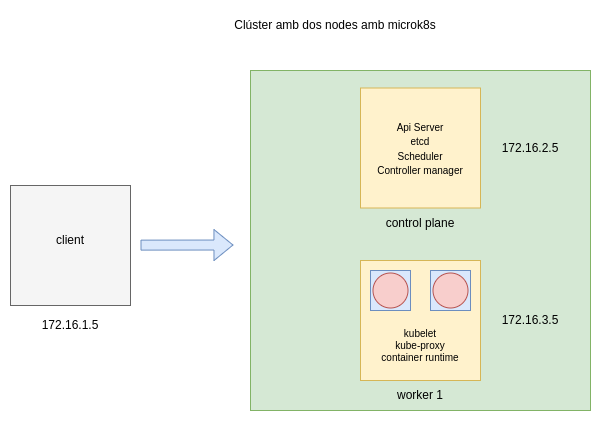

# Desplegament d'un clúster de Kubernetes amb MicroK8s

Video a la prova realitzada: <a href="" target="_blank">Proves amb microk8s: statefulset i el gesto de paquets Helm </a>

## Objectiu



Crear un clúster amb microk8s i provar diverses funcionalitats: 

## Creació del clúster amb els dos nodes: 

Al servidor controlplane:

```
microk8s start
microk8s enable hostpath-storage
microk8s enable dns
microk8s add-node
```

La instrucció microk8s add-node generarà un token per executar al segon servidor.

Al servidor worker1:

```
microk8s join 172.16.2.5:25000/{token} --worker
```

## StatefulSet

StatefulSet és un objecte de la API de Kubernetes que representa un conjunt de pods que tenen un estat estable. Això vol dir que tenen identificadors únics de xarxa,
persistència de dades, i mantenen un ordre a l'hora de desplegar-se, esborrar-se o actualitzar-se. Són adequats per aplicacions com bases de dades. 

Estan formats per tres components, un Headless Service que és un tipus de servei que no assigna direccions IP virtuals a un conjunt de pods. Els pods, i els persistent volume claims i els persistent volums, els objectes involucrats en la persistència de dades.

```
apiVersion: v1
kind: Service
metadata:
  name: nginx
  labels:
    app: nginx
spec:
  ports:
  - port: 80
    name: web
  clusterIP: None
  selector:
    app: nginx
---
apiVersion: apps/v1
kind: StatefulSet
metadata:
  name: web
spec:
  serviceName: "nginx"
  replicas: 2
  selector:
    matchLabels:
      app: nginx
  template:
    metadata:
      labels:
        app: nginx
    spec:
      containers:
      - name: nginx
        image: registry.k8s.io/nginx-slim:0.8
        ports:
        - containerPort: 80
          name: web
        volumeMounts:
        - name: www
          mountPath: /usr/share/nginx/html
  volumeClaimTemplates:
  - metadata:
      name: www
    spec:
      accessModes: ["ReadWriteOnce"]
      resources:
        requests:
          storage: 1Gi
```

## Helm

Helm és un gestor de paquets per a Kubernetes. Els seus paquets s'anomenen charts, i permeten instal·lar, actualitzar, i desinstal·lar aplicacions dins dels clústers fàcilment. També permet crear charts i compartir-los. 

### Instal·lació d'una aplicació amb Helm

```
helm repo add bitnami https://charts.bitnami.com/bitnami
helm show values bitnami/wordpress
```

Modificar els valors que siguin necessaris passant la configuració en un fitxer values.yaml

```
wordpressUsername: admin
wordpressPassword: wordpress
```

```
helm install my-wordpress -f values.yaml bitnami/wordpress --version 18.1.19
```

```
kubectl port-forward --address 0.0.0.0 service/my-wordpress 7000:8080
```

### Creació d'un chart-Helm

Helm també permet crear charts propis a partir de fitxers manifests, que després es poden compartir.

Els passos a seguir són:

* Creació d'una carpeta per al projecte
```
mkdir my-chart
```

* Dins de la carpeta executar helm create 'nom de l'aplicació'

```
helm create graph-solver
```

* L'estructura de carpetes resultant és la següent:

carpeta chart: és on anirien els charts dels que depengués el nostre Chart, es pot deixar igual.

fitxer Chart.yaml: mostra informació del Chart, es pot deixar o modificar els camps que es vulgui.

carpeta templates: aquí és on aniran els fitxers manifests de la nostra aplicació, es poden esborrar els de mostra, només deixar _helpers.tpl i NOTES.txt.

El fitxer NOTES.txt es pot modificar per mostrar un missatge en finalitzar la instal·lació.

El fitxer _helpers.tpl es pot esborrar/modificar el seu contingut.

A la carpeta de templates/tests tamb es pot esborrar el contigut.

values.yaml: es pot esborrar el contigut i afegir els valors per defecte de les claus dels manifests que els usuaris podràn modificar.

```
ReplicaCount: 1
NodePortNumber: 30001
```

Al fitxer del deployment.yaml afegir els valors que volem que l'usuari pugui modificar en realitzar la instal·lació:

```
spec:
  replicas: {{ .Values.ReplicaCount }}
  selector:
    matchLabels:
      app: graphsolver-app
...

- protocol: TCP
    port: 8080
    targetPort: 80
    nodePort: {{ .Values.NodePortNumber }}
  type: NodePort

```
* Situar-se a un nivell superior de la carpeta de l'aplicació i executar helm package graph-solver per empaquetar l'aplicació i helm repo index per generar un fitxer index.yaml del repositori.

```
helm package graph-solver
```

```
helm repo index .
```

A partir d'aquí es pot penjar en el repositori oficial d'Helm o bé penjarlo en un servidor web propi, en aquest cas per fer una prova es pot crear un contenidor docker i afegir el contingut.

```
docker run -dp 3000:80 -v $(pwd):/usr/local/apache2/htdocs/ --name repohelm httpd:alpine
```

### Instal·lació del chart graph-solver

```
helm repo add josan http://localhost:3000
helm show values josan/graph-solver
helm install graph-solver josan/graph-solver -f values2.yaml
helm list

```

### Desinstalació del chart i el repositori  

```
helm uninstall graph-solver
helm repo remove josan
helm repo list
```


