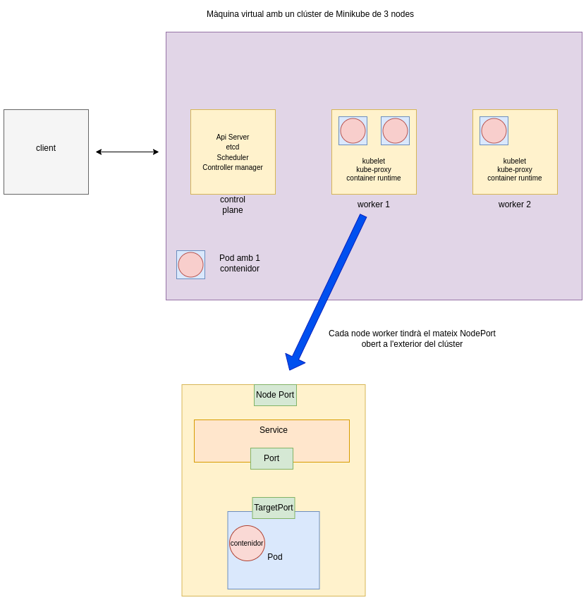

# Desplegament d'un clúster de Kubernetes amb Minikube

Video a la prova realitzada: <a href="https://youtu.be/U6eXTDGd9gY" target="_blank">Proves amb minikube: deployment, autoescaling, rollout. </a>

## Objectiu



Crear un clúster amb minikube i provar diverses funcionalitats: deployment, autoescaling, rollout.

## Crear un cluster de kubernetes amb 3 nodes.

```
minikube start -n 3
```

## Activar dos addons de minikube: mètriques i dashboard.

```
minikube addons list
minikube addons enable metrics-server
minikube addons enable dashboard
```

## Etiquetes de rol als dos nodes workers.

```
kubectl label node minikube-m02 node-role.kubernetes.io/worker=worker
kubectl label node minikube-m03 node-role.kubernetes.io/worker=worker
```

## Treballar en un nou namespace 'test'.

Un namespace és una subdivisió virtual d'un clúster, permet
separar i organitzar els recursos segons diferents propòsits, com ara testing, desenvolupament, producció. Si s'esborra un namespace, s'esborren també tots els seus recursos (pods, services, deployments, etc.)

Un context defineix si un clúster és local o remot, l'usuari que hi té accés, i un namespace predeterminat. S'utilitza per canviar ràpidament en entorns amb diferents clústers o en entorns dins de Kubernetes.

```
kubectl get namespaces
kubectl create namespace testing
kubectl config view | grep current-context
kubectl config set-context minikube --namespace=testing
```

## Crear un deployment amb 3 pods.

Un deployment és un recurs de Kubernetes que defineix l'estat desitjat per a les aplicacions en execució d'un clúster. Permet declarar, actualitzar i escalar aplicacions.

```
apiVersion: apps/v1
kind: Deployment
metadata:
  name: my-node-deployment
  labels:
    app: my-node
spec: 
  replicas: 3
  selector:
    matchLabels:
      app: my-node
  template:
    metadata:
      labels:
        app: my-node
    spec:
      containers:
      - name: my-node-container
        image: josanescod/node-simple-app:1.0
        ports:
        - containerPort: 3000
```

kubectl apply -f deployment1.yaml
kubectl describe pods | grep 'Image'

## Eliminar un pod i veure com kubernetes ho detecta i torna a crear un de nou.

```
kubectl delete pod my-node-deployment-79dd7879c7-5qb4c
kubectl get pods
```

## Autoescaling manual: augmentar i disminuir la quantitat de pods.

```
kubectl scale --replicas 5 deployment.apps/my-node-deployment
kubectl scale --replicas 2 deployment.apps/my-node-deployment
```

## Crear un servei de tipus NodePort per exposar els pods fora del clúster.

Un servei de tipus NodePort proporciona una IP interna, i obre un port a cada node del clúster, que permet accedir al servei des de fora del clúster utilitzant la IP del node i el port assignat.

```
apiVersion: v1
kind: Service
metadata:
  name: my-node-service
spec:
  selector:
    app: my-node
  ports:
  - protocol: TCP
    port: 80
    targetPort: 3000
  type: NodePort
```

kubectl apply -f service.yaml

## Mostrar en un navegador l'aplicació my-node-app amb kubectl port-forward

```
kubectl get svc
ip=$(minikube ip)
curl $ip:NodePort

kubectl port-forward --address 0.0.0.0 7000:80
obrir el navegador amb l'adreça http://172.16.2.5:7000
```
## Executar un segon deployment que fa un rollout dels pods

```
apiVersion: apps/v1
kind: Deployment
metadata:
  name: my-node-deployment
  labels:
    app: my-node
spec: 
  replicas: 3
  selector:
    matchLabels:
      app: my-node
  minReadySeconds: 20
  strategy:
    type: RollingUpdate
    rollingUpdate:
      maxSurge: 1
      maxUnavailable: 0
  template:
    metadata:
      labels:
        app: my-node
    spec:
      containers:
      - name: my-node-container
        imagePullPolicy: Always
        image: josanescod/node-simple-app:2.0
        ports:
        - containerPort: 3000
```

Un rollout és una actualització d'un deployment de manera controlada i gradual.

minReadySeconds: temps mínim que un pod té que està en estat 'READY' abans de considerar-se disponible. Serveix per donar un temps d'espera entre actualització de cada pod.

maxSurge: nombre màxim de pods adicionals que es poden crear per sobre de les rèpliques declarades. Permet un augment d'un pod temporal per sobre de les rèpliques (3) per facilitar l'actualització gradual sense interrupcions. 

maxUnavailable: En aquest exemple s'estableix que cap pod, pot estar 'no disponible' a la vegada durant una actualització.

kubectl apply -f deploy2.yaml

kubectl rollout status deployment/my-node-deployment

kubectl describe pods | grep 'Image'

## Mostrar en un navegador que my-node-app s'ha actualitzat a la versió 2.0

```
kubectl port-forward --address 0.0.0.0 7000:80
obrir el navegador amb l'adreça http://172.16.2.5:7000
```

## Mostrar el dashboard del cluster. 

```
minikube dashboard --url &
kubectl proxy --address=0.0.0.0 --accept-hosts='.*' &
```
